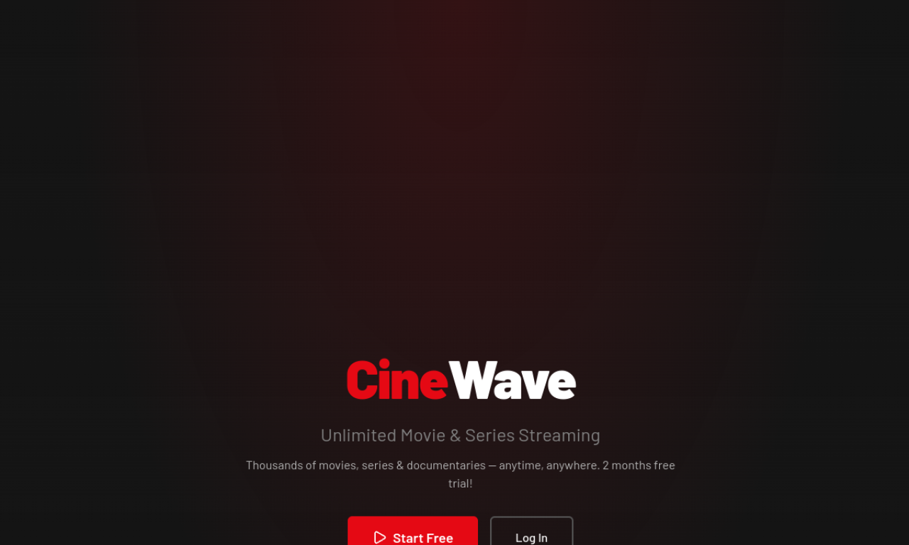
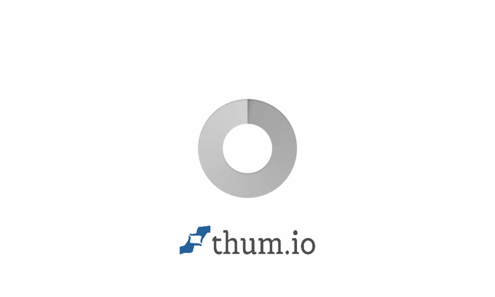

<div align="center">

```
  █████╗ ███████╗██╗███████╗
 ██╔══██╗██╔════╝██║██╔════╝
 ███████║███████╗██║█████╗  
 ██╔══██║╚════██║██║██╔══╝  
 ██║  ██║███████║██║██║     
 ╚═╝  ╚═╝╚══════╝╚═╝╚═╝     
 ██╗ ██████╗ ██████╗  █████╗ ██╗
 ██║██╔═══██╗██╔══██╗██╔══██╗██║
 ██║██║   ██║██████╔╝███████║██║
 ██║██║▄▄ ██║██╔══██╗██╔══██║██║
 ██║╚██████╔╝██████╔╝██║  ██║███████╗
 ╚═╝ ╚══▀▀═╝ ╚═════╝ ╚═╝  ╚═╝╚══════╝
```

### `> Software Engineer`

</div>

<!-- ===== ANIMATED TYPING SVG ===== -->
<p align="center">
  <a href="https://git.io/typing-svg">
    
  </a>
</p>

<!-- ===== PROFILE BADGES ===== -->
<p align="center">
  <a href="https://asif-portfolio-three.vercel.app/"></a>&nbsp;
  <a href="https://www.linkedin.com/in/md-asif-iqbal-652473185/"></a>&nbsp;
  <a href="mailto:md.asifiqbal2008@gmail.com"></a>&nbsp;
  
</p>

<!-- ===== ANIMATED DIVIDER ===== -->


<!-- ===== ABOUT ME ===== -->

##  &nbsp;About Me

```js
const asif = {
    name: "Md Asif Iqbal",
    role: "Full Stack Developer & Software Engineer",
    education: "BSc in CSE (Software Engineering) — UIU, Dhaka",
    location: "Dhaka, Bangladesh 🇧🇩",
    
    currentlyBuilding: [
        "🎬 CINEWAVE — Netflix-style Movie Streaming",
        "🎓 NexLearn — AI-Powered Education Platform",
        "🤖 AI Interview System — Proctored AI Hiring",
        "🛒 SoftLanding POS — 61-Page Enterprise ERP"
    ],
    
    learning: ["ERPNext", "Microservices", "System Design"],
    
    expertise: {
        frontend: ["Next.js 14-16", "React 18-19", "TypeScript", "Tailwind CSS", "Redux", "Zustand"],
        backend:  ["Node.js", "Express", "Django", "REST APIs", "NextAuth", "JWT"],
        database: ["MongoDB Atlas", "Mongoose", "MySQL"],
        ai:       ["Google Gemini AI", "OpenCV", "Face Recognition", "NLP"],
        payments: ["Stripe", "SSLCommerz"],
        devops:   ["Docker", "Vercel", "Firebase", "Git", "GitHub Actions"]
    },
    
    totalRepos: "69+",
    funFact: "I mass push production-ready apps while the world sleeps ☕→🚀"
};
```


<!-- ===== TECH STACK ===== -->

##  &nbsp;Tech Arsenal

<table>
<tr>
<td valign="top" width="33%">

### 🎨 Frontend
<p align="center">
  
</p>
</td>

<td valign="top" width="33%">

### ⚙️ Backend & Database
<p align="center">
  
</p>
</td>

<td valign="top" width="33%">

### 🔧 Tools & Platforms
<p align="center">
  
</p>
</td>
</tr>
</table>

<details>
<summary><b>📊 Detailed Skill Proficiency (Click to expand)</b></summary>
<br>

```text
Next.js / React.js    ██████████████████████████████████████████████░░  95%
TypeScript / JS       ████████████████████████████████████████████░░░░  92%
Tailwind / shadcn/ui  █████████████████████████████████████████████░░░  93%
MongoDB / Mongoose    ████████████████████████████████████████████░░░░  90%
Node.js / Express     ██████████████████████████████████████████░░░░░░  88%
Redux / Zustand       █████████████████████████████████████████░░░░░░░  85%
AI Integration        ████████████████████████████████████████░░░░░░░░  82%
Python / Django       ██████████████████████████████████████░░░░░░░░░░  80%
Stripe / SSLCommerz   █████████████████████████████████████░░░░░░░░░░░  78%
Docker / DevOps       ███████████████████████████████████░░░░░░░░░░░░░  70%
```

</details>


<!-- ===== FEATURED PROJECTS ===== -->

##  &nbsp;Featured Projects

<table>
<tr>
<td width="50%">

### 🎬 [CINEWAVE — Movie Streaming Platform](https://github.com/md-asif-iqbal/CINEWAVE-Movie-Platform)

<a href="https://github.com/md-asif-iqbal/CINEWAVE-Movie-Platform">
  
</a>

<p>
  
  
  
  
  
  
  
</p>

**Netflix-inspired** streaming — multi-profile (5/account), SSLCommerz payments, Google OAuth + Firebase OTP, admin dashboard, YouTube integration & real-time search.

</td>
<td width="50%">

### 🎓 [NexLearn — AI Education Platform](https://github.com/md-asif-iqbal/EDU-Platfrom-NexLearn)

<a href="https://edu-platfrom-nex-learn.vercel.app/">
  
</a>

<p>
  
  
  
  
  
  
</p>

**AI-Powered** tutoring — 4 Gemini AI tools, Stripe payments, Jitsi live video, 3 dashboards (Student/Tutor/Admin) & 27 routes.

🔗 [**Live Demo**](https://edu-platfrom-nex-learn.vercel.app/)

</td>
</tr>

<tr>
<td width="50%">

### 🤖 [AI-Powered Interview System](https://github.com/md-asif-iqbal/Ai-Based-Interview-Systems)

<a href="https://ai-based-interview-systems.vercel.app/">
  
</a>

<p>
  
  
  
  
  
  
</p>

**AI-Powered** interviews — smart resume analysis, real-time proctoring (face detection, tab switching, screen recording), Gemini AI question generation & answer evaluation.

🔗 [**Live Demo**](https://ai-based-interview-systems.vercel.app/)

</td>
<td width="50%">

### 🛒 [SoftLanding POS — Enterprise ERP](https://github.com/md-asif-iqbal/SoftLanding-POS-system)

<a href="https://soft-landing-pos-system-v2.vercel.app/">
  
</a>

<p>
  
  
  
  
  
  
</p>

**Enterprise-grade** POS — 61 pages, real-time sales, inventory, 14 report modules (P&L, CSV/Excel/PDF), HR & payroll, RBAC, dark mode.

🔗 [**Live Demo**](https://soft-landing-pos-system-v2.vercel.app/)

</td>
</tr>
</table>


<!-- ===== MORE PROJECTS ===== -->

<details>
<summary>
  <h3>
    
    📂 All Other Notable Projects (Click to expand)
  </h3>
</summary>
<br>

<p align="center">
  
</p>

#### 🌐 Web Applications — Full Stack

| # | Project | Tech Stack | Live | Description |
|:-:|:--------|:-----------|:----:|:------------|
| 1 | **[Wathta Dashboard](https://github.com/md-asif-iqbal/Wathta-Dashboard-with-NextJS)** | Next.js 16, TypeScript, ShadCN, TanStack, MongoDB | [🔗](https://wathta-dashboard-with-next-js-ndvq.vercel.app/) | Admin dashboard — CRUD, analytics, Recharts, dark mode |
| 2 | **[Product Management](https://github.com/md-asif-iqbal/Product-management-with-nextJS)** | Next.js 15, Redux Toolkit, MongoDB, JWT, Zod | [🔗](https://product-management-with-next-js-2ek.vercel.app/products) | Full-stack product system with RTK Query & auth |
| 3 | **[NECX Messaging](https://github.com/md-asif-iqbal/NECX-Messaging-Frontend)** | React 18, Zustand, Vite 5, Node.js | [🔗](https://necx-messaging-frontend.vercel.app/) | Real-time messaging — multi-persona, optimistic UI |
| 4 | **[BrightMind Blog](https://github.com/md-asif-iqbal/BrightMind-Blog-Fronend)** | React 18, Vite, TailwindCSS v4, MERN | [🔗](https://bright-mind-blog-fronend.vercel.app/) | Full MERN blog — JWT auth, admin panel, comments |
| 5 | **[Todo App](https://github.com/md-asif-iqbal/todo-list)** | Next.js, Zod, MongoDB | [🔗](https://todo-list-smoky-tau-27.vercel.app/) | Task manager with validation & CRUD operations |
| 6 | **[Read Books](https://github.com/md-asif-iqbal/read-your-fevourite-books)** | Next.js, JavaScript | [🔗](https://read-books-sand.vercel.app/) | Book reading platform with curated collections |
| 7 | **[Portfolio v2](https://github.com/md-asif-iqbal/Asifs-Portfolio)** | TypeScript, Next.js | [🔗](https://asifsportfolio.vercel.app/) | Personal portfolio — career showcase & projects |
| 8 | **[Take Your Smile](https://github.com/md-asif-iqbal/take-your-smile-client-side)** | TypeScript, React, Firebase | [🔗](https://event-management-system-chi-ten.vercel.app/) | Event management — team of 6, ⭐ 2 stars |
| 9 | **[Eclipse Bistro](https://github.com/md-asif-iqbal/eclipse-bistro-restaurants)** | JavaScript, React, Node.js | — | Restaurant management & ordering system |

#### 🏢 Enterprise & Management Systems

| # | Project | Tech Stack | Live | Description |
|:-:|:--------|:-----------|:----:|:------------|
| 10 | **[School Management](https://github.com/md-asif-iqbal/School-management)** | Next.js, TypeScript, MongoDB | — | Student & teacher management, grading, attendance |
| 11 | **[Courier & Parcel](https://github.com/md-asif-iqbal/Courier-Parcel-Management-System-Frontend)** | JavaScript, Node.js, MongoDB | [🔗](https://courier-parcel-management-system-v1.vercel.app/) | Parcel tracking & delivery scheduling |
| 12 | **[E-KYC System](https://github.com/md-asif-iqbal/E-KYC-system-client-side)** | JavaScript, Node.js, MongoDB | — | Digital identity verification |
| 13 | **[Leave Management](https://github.com/md-asif-iqbal/LEAVE_MANAGEMENT)** | PHP | — | Employee leave request system |
| 14 | **[Hostel Management](https://github.com/md-asif-iqbal/hostel-management-system)** | JavaScript | — | Hostel room allocation & billing |
| 15 | **[Doctors Portal](https://github.com/md-asif-iqbal/doctors-portal-client-sites)** | JavaScript, React, Tailwind | — | Doctor appointment booking system |

#### 🤖 AI, ML & Python Projects

| # | Project | Tech Stack | Live | Description |
|:-:|:--------|:-----------|:----:|:------------|
| 16 | **[Face Recognition](https://github.com/md-asif-iqbal/Face-regonization-attandance-system)** | Python, OpenCV, Jupyter | — | AI face recognition attendance system |
| 17 | **[Job Portal](https://github.com/md-asif-iqbal/job_portal)** | Python, Django | — | Job listing & application portal |

#### 🎓 University & Community Projects

| # | Project | Tech Stack | Live | Description |
|:-:|:--------|:-----------|:----:|:------------|
| 18 | **[UIU Club Forum](https://github.com/md-asif-iqbal/uiu-club-forum-client-side)** | JavaScript, React | — | University club discussion forum |
| 19 | **[UIU Crowdfunding](https://github.com/md-asif-iqbal/uiu-crowdfounding-apps)** | JavaScript, React | — | University crowdfunding platform |
| 20 | **[University Auth](https://github.com/md-asif-iqbal/university-management-auth-service-system)** | TypeScript | — | Auth microservice for university system |
| 21 | **[Blood Donation](https://github.com/md-asif-iqbal/blood-donation)** | JavaScript, React | — | Donor & recipient matching platform |

#### 🎮 Other & Experimental

| # | Project | Tech Stack | Live | Description |
|:-:|:--------|:-----------|:----:|:------------|
| 22 | **[Chess Game](https://github.com/md-asif-iqbal/Chess-game-aoop)** | Java | — | Advanced OOP chess game |
| 23 | **[Drone Manufacturer](https://github.com/md-asif-iqbal/drone-manufacturer-website-client-side)** | JavaScript, React | — | Drone company website & orders |

<p align="center">
  <i>⚡ ...and 46+ more repositories across various technologies!</i>
</p>

</details>

<p align="center">
  <a href="https://github.com/md-asif-iqbal?tab=repositories">
    
  </a>
</p>


<!-- ===== ACHIEVEMENTS ===== -->

##  &nbsp;Achievements & Highlights

<p align="center">
  &nbsp;
  &nbsp;
  &nbsp;
  &nbsp;
  &nbsp;
  
</p>

<details>
<summary><b>🌍 Live Deployment Links (Click to expand)</b></summary>
<br>

<p align="center">

| # | Project | Live URL | Status |
|:-:|:--------|:---------|:------:|
| 1 | 🎬 CINEWAVE | [cinewave-movie-platform.vercel.app](https://cinewave-movie-platform.vercel.app/) |  |
| 2 | 🎓 NexLearn | [edu-platfrom-nex-learn.vercel.app](https://edu-platfrom-nex-learn.vercel.app/) |  |
| 3 | 🤖 AI Interview | [ai-based-interview-systems.vercel.app](https://ai-based-interview-systems.vercel.app/) |  |
| 4 | 🛒 SoftLanding POS | [soft-landing-pos-system-v2.vercel.app](https://soft-landing-pos-system-v2.vercel.app/) |  |
| 5 | 📊 Wathta Dashboard | [wathta-dashboard.vercel.app](https://wathta-dashboard-with-next-js-ndvq.vercel.app/) |  |
| 6 | 📦 Product Management | [product-management.vercel.app](https://product-management-with-next-js-2ek.vercel.app/products) |  |
| 7 | 💬 NECX Messaging | [necx-messaging.vercel.app](https://necx-messaging-frontend.vercel.app/) |  |
| 8 | ✍️ BrightMind Blog | [bright-mind-blog.vercel.app](https://bright-mind-blog-fronend.vercel.app/) |  |
| 9 | 🌐 Portfolio | [asif-portfolio.vercel.app](https://asif-portfolio-three.vercel.app/) |  |
| 10 | 😊 Take Your Smile | [event-management.vercel.app](https://event-management-system-chi-ten.vercel.app/) |  |

</p>
</details>


<!-- ===== GITHUB ANALYTICS ===== -->

##  &nbsp;GitHub Analytics

<!-- GitHub Stats (using multiple reliable providers) -->
<p align="center">
  <picture>
    <source media="(prefers-color-scheme: dark)" srcset="https://github-readme-stats-sigma-five.vercel.app/api?username=md-asif-iqbal&show_icons=true&theme=tokyonight&hide_border=true&bg_color=0d1117&title_color=a855f7&icon_color=6366f1&text_color=c9d1d9&ring_color=a855f7&count_private=true&include_all_commits=true" />
    <source media="(prefers-color-scheme: light)" srcset="https://github-readme-stats-sigma-five.vercel.app/api?username=md-asif-iqbal&show_icons=true&theme=default&hide_border=true&count_private=true&include_all_commits=true" />
    
  </picture>
  <picture>
    <source media="(prefers-color-scheme: dark)" srcset="https://streak-stats.demolab.com?user=md-asif-iqbal&theme=tokyonight&hide_border=true&background=0D1117&ring=a855f7&fire=6366f1&currStreakLabel=a855f7&sideLabels=c9d1d9&dates=8b949e&currStreakNum=c9d1d9&sideNums=c9d1d9" />
    <source media="(prefers-color-scheme: light)" srcset="https://streak-stats.demolab.com?user=md-asif-iqbal&theme=default&hide_border=true" />
    
  </picture>
</p>

<!-- Top Languages -->
<p align="center">
  <picture>
    <source media="(prefers-color-scheme: dark)" srcset="https://github-readme-stats-sigma-five.vercel.app/api/top-langs/?username=md-asif-iqbal&layout=compact&theme=tokyonight&hide_border=true&bg_color=0d1117&title_color=a855f7&text_color=c9d1d9&langs_count=10" />
    <source media="(prefers-color-scheme: light)" srcset="https://github-readme-stats-sigma-five.vercel.app/api/top-langs/?username=md-asif-iqbal&layout=compact&theme=default&hide_border=true&langs_count=10" />
    
  </picture>
</p>

<!-- Profile Summary Cards (backup stats that always render) -->
<p align="center">
  
  
  
</p>


<!-- Activity Graph -->
## 📈 Contribution Graph

<p align="center">
  <a href="https://github.com/md-asif-iqbal">
    
  </a>
</p>


<!-- ===== GITHUB TROPHIES ===== -->

## 🏆 GitHub Trophies

<p align="center">
  <a href="https://github.com/ryo-ma/github-profile-trophy">
    
  </a>
</p>


<!-- ===== CONTRIBUTION SNAKE ===== -->

## 🐍 Contribution Snake

<picture>
  <source media="(prefers-color-scheme: dark)" srcset="https://raw.githubusercontent.com/md-asif-iqbal/md-asif-iqbal/output/github-snake-dark.svg" />
  <source media="(prefers-color-scheme: light)" srcset="https://raw.githubusercontent.com/md-asif-iqbal/md-asif-iqbal/output/github-snake.svg" />
  
</picture>


<!-- ===== WHAT I'M UP TO ===== -->

##  &nbsp;What I'm Currently Up To

<table>
<tr>
<td>

🔭 &nbsp; Working on **AI-Powered Web Applications** & **Enterprise Software**

🎬 &nbsp; Just shipped **CINEWAVE** — a full Netflix-style streaming platform

🤖 &nbsp; Building **AI Interview & Education platforms** with **Google Gemini AI**

🛒 &nbsp; Developed **SoftLanding POS** — 61-page enterprise ERP system

📚 &nbsp; Learning **ERPNext**, **Microservices Architecture** & **System Design**

💬 &nbsp; Ask me about **Next.js, React, TypeScript, MongoDB, AI Integration**

⚡ &nbsp; Fun Fact: **69+ repos** and mass shipping production apps!

</td>
<td>
  
</td>
</tr>
</table>


<!-- ===== CONNECT ===== -->

##  &nbsp;Let's Connect

<p align="center">
  <a href="https://www.linkedin.com/in/md-asif-iqbal-652473185/" target="_blank">
    
  </a>&nbsp;
  <a href="mailto:md.asifiqbal2008@gmail.com">
    
  </a>&nbsp;
  <a href="https://asif-portfolio-three.vercel.app/" target="_blank">
    
  </a>&nbsp;
  <a href="https://www.facebook.com/asifiqbal2008" target="_blank">
    
  </a>&nbsp;
  <a href="https://www.instagram.com/asif.iqbal_____/" target="_blank">
    
  </a>&nbsp;
  <a href="https://github.com/md-asif-iqbal" target="_blank">
    
  </a>
</p>


<!-- ===== DEV QUOTE ===== -->

## 💭 Dev Quote of the Day

<p align="center">
  
</p>


<!-- ===== ANIMATED FOOTER ===== -->

<p align="center">
  <a href="https://git.io/typing-svg">
    
  </a>
</p>

<p align="center">
  <b>"Dedicated to building intelligent and scalable systems that transform the digital landscape."</b>
</p>

<p align="center">
  ⭐️ From <a href="https://github.com/md-asif-iqbal">Md Asif Iqbal</a> — If you like my work, consider giving a ⭐!
</p>

<!-- ===== FOOTER ===== -->

